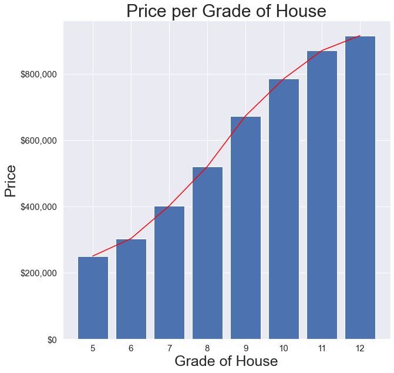
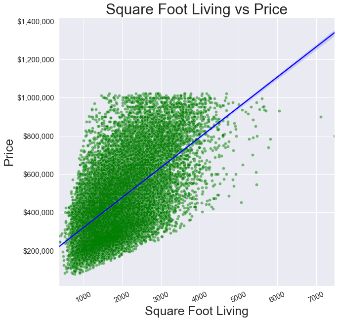

# Housing Data in King County, WA  
**Data Scientist:**  Anhduy(Andy) Nguyen, Juliet Day, Xibei(Julian) He  
**Date:** May 13, 2022

SounderBruce210122-030120.jpg)
## **Business Understanding**
A real estate developer has expressed interest in developing real estate in the King County, WA area. They have come to us as a team of trained data scientists to recommend an optimized real estate development strategy on the kind of houses they should build and in what areas. This analysis will use different statistical analysis tools including, but not limited to, multiple linear regression, shuffle split validation, cross-validation and OneHotEncoder to find what attributes of a house contribute the most to the house’s value, therefore yielding the highest revenue for the developers.

## **Key business questions**
1. What are the effects of zip code on the overall pricing of a house?
2. How much does the size of the house affect the pricing of a house?
3. Do the materials built have an overall effect on the pricing of a house?

## **Data Understanding** 
The main data set used was, King County Housing Data, collected from 2014 to 2015. This data includes the unique identifier for the property, date of sale price, sale price, number of bedrooms, number of bathrooms, square footage of living space in the home, square footage of the lot, number of levels in the house, if it is a waterfront property, quality of the view from the house, the overall condition of the house, the grade of the house, the square footage of the house apart from the basement, square footage of the basement, year it was built, year it was renovated if it was renovated, zip code, the coordinates of the house in latitude and longitude, the square footage of interior house living space for the nearest 15 neighbors, and the square footage lot space of the nearest 15 neighbors. The data set was then cleaned before analysis was run on it.

The second data set, Zipcodes for King County and Surrounding Area, includes location data for King County. This data set was used for mapping purposes.

 

## **Methodology & Results**

1. Our first best model approach was an iterative approach. We first found the highest correlation feature to **Price** which was **Grade**. We than used high correlation with other features, high p-value, and recurive feature elimination to to find the best model. 
2. Our second model we OneHotEncoded Zipcode to make them categories and slowly removed features that had a high p-value and than removed features with high VIF to find the best model.

3. We ran both models through three validation test: Train-test, Cross Validation, and Shuffle-Split.  Than we ran them through assumption test such as Linear Assumption, Normality and homoscedasticity.

 

## **Statistical Analysis**
 

### **House Grade**

 
The graph shows that as you increase in the grade of the house the sales price of the house increases. The line on the bar graphs shows that the greatest increase in price per grade increase occurs between 7 and 10 where the line tapers of after 10. It is reccomended that the developer build houses within this range

 

### **Location**

As you can see by the heat map above the average housing price is significantly impacted by the location where housing price near the center of the city on average cost way more than housing prices on the outskirts of the city. The zipcodes with the highest averages are 98039, 98040, 98004,98005, which are shown as the dark purple areas. 

 

### **Square foot size**

The graph shows that there is a linear relationship between Square Foot Living and Price. The most dense area's of the graph seem to be along the best fit line. We reccomend building houses between 1,600 to 3,300 square feet which are high density areas on the graph but also coincide with grade 7 to 10.

 

## **Conclusions**
1. **Square foot** living has a good correlation with pricing.  Data shows that a good size ranges between 1600 - 3300 square feet.  Where each square foot increases value by $90.

2. Build homes with **Grades between 7 to 10** because the data shows that they have the highest growth range in house value.

3. **Zipcode/location** is a very important factor in house value according to our data.  Building in a high value zipcode can increase your house value by **$100,000**.

## **Next Steps**
1. **View/Waterfront** seems correlate highly with price by looking at the zipcode heatmap it shows waterfront properties have high average prices compared to non waterfront properties.  If we had more time looking into this point would be good.
2. **Cost of building and anymore development information** would help build a better model and add a cost - profit analysis.
3. More **Data** would be very important.  The data set given was only for 2 years and while it built a decent model it could be better if the data was over a longer period of time.

## **Contact Info**
Email:
- Andy Nguyen: anguyen61191@gmail.com

- Xibei (Julian) He: julianhe1991@gmail.com

- Juliet Day: julietday422@gmail.com

Linkedin: 
- Andy Nguyen: https://www.linkedin.com/in/anhduy-nguyen-217402149/

- Xibei (Julian) He: https://www.linkedin.com/in/xibeihe/

- Juliet Day: https://www.linkedin.com/in/julietday/

Github:

- Anhduy Nguyen [github](https://github.com/anguyen61191)

- Xibei (Julian) He [github](https://github.com/JulianHe1991)

- Juliet Day [github](https://github.com/julietday422)